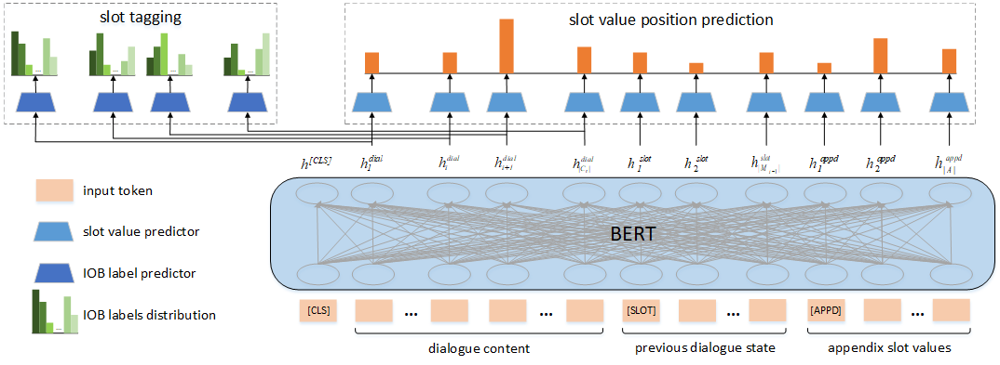

# STN4DST
 
This code is the official pytorch implementation of paper: **STN4DST: A Scalable Dialogue State Tracking based on Slot Tagging Navigation**

## Abstract
Scalability for handling unknown slot values is a important problem in dialogue state tracking (DST). As far as we know, previous scalable DST approaches generally rely on either the candidate generation from slot tagging output or the span extraction in dialogue context. However, the candidate generation based DST often suffers from error propagation due to its pipelined two-stage process; meanwhile span extraction based DST has the risk of generating invalid spans in the lack of semantic constraints between start and end position pointers. To tackle the above drawbacks, in this paper, we propose a novel scalable dialogue state tracking method based on slot tagging navigation, which implements an end-to-end single-step pointer to locate and extract slot value quickly and accurately by the joint learning of slot tagging and slot value position prediction in the dialogue context, especially for unknown slot values. Extensive experiments over several benchmark datasets show that the proposed model performs better than state-of-the-art baselines greatly. Besides, we have publicly released all codes.

## Requirements
* python 3.6
* pytorch >= 1.0